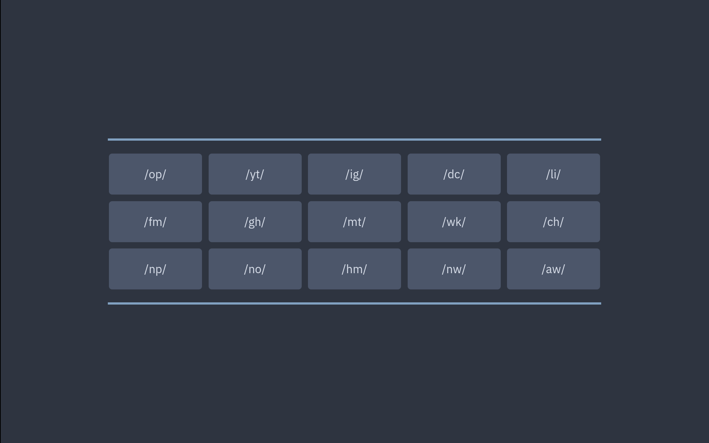

# homepage

A pure Nix static homepage generator. Clean, keyboard-navigable startpages with
zero dependencies and full control over layout, colors, etc.



## Contents

<!--toc:start-->

- [Features](#features)
- [Example](#example)
- [How It Works](#how-it-works)
  - [Example](#example)
- [Customizing Colors](#customizing-colors)
- [Layout Reference](#layout-reference)
- [Outputs](#outputs)
- [Keyboard Shortcuts](#keyboard-shortcuts)

<!--toc:end-->

## Features

- **Declarative layout**: define your homepage structure entirely in Nix.
- **Theming via [sotormd/colors](https://github.com/sotormd/colors)**:
  consistent Nord-like palette for backgrounds, text, and accents.
- **Custom fonts and grid size**: configure both with a single argument.
- **Keyboard shortcuts**: type the short name to instantly open a link.
- **Dynamic hover colors**: links smoothly change to aurora tones on hover.
- **Pure Nix**: uses only `builtins`, so it works anywhere without external
  dependencies.

## Example

You can build and preview the included example homepage directly:

```bash
nix build github:sotormd/homepage
```

This creates a symlink `result` in the current working directory, which can be
opened in the browser.

## How It Works

The flake exposes a single function:

```nix
lib.makeHomepage
```

It takes a **layout list**, where each element is either:

- a **list of links**, or
- the string `"separator"` (to visually separate sections).

### Example

```nix
home.lib.makeHomepage {
  layout = [
    [
      { short = "re"; full = "reddit"; url = "https://reddit.com"; }
      { short = "dc"; full = "discord"; url = "https://discord.com/app"; }
    ]

    "separator"

    [
      { short = "yt"; full = "youtube"; url = "https://youtube.com"; }
      { short = "gh"; full = "github"; url = "https://github.com"; }
    ]

    "separator"
  ];

  n = 2;                    # grid size (columns per row)
  font = "'IBM Plex Sans'"; # custom font family
}
```

## Customizing Colors

By default, it uses [`sotormd/colors`](https://github.com/sotormd/colors). You
can override this by passing your own color flake (see the flakes for expected
schema).

```nix
{
  description = "Custom themed homepage";

  inputs = {
    home.url = "github:sotormd/home";
    colors.url = "path:/home/vrm/Projects/my-colors"; # your own color flake
  };

  outputs = { self, home, colors, ... }: {
    packages.x86_64-linux.default =
      let
        layout = [
          [
            { short = "yt"; full = "youtube"; url = "https://youtube.com"; }
            { short = "gh"; full = "github"; url = "https://github.com"; }
          ]
        ];

        html = home.lib.makeHomepage {
          inherit layout;
          font = "'Fira Code'";
          n = 4;
        };
      in
      builtins.toFile "homepage.html" html;
  };
}
```

## Layout Reference

Each layout element can be one of:

| Type              | Description                  | Example                                                                    |
| ----------------- | ---------------------------- | -------------------------------------------------------------------------- |
| **List of links** | A row of link boxes          | `[ { short = "yt"; full = "youtube"; url = "https://youtube.com"; } ... ]` |
| **"separator"**   | Horizontal line between rows | `"separator"`                                                              |

Each link entry looks like:

```nix
{ short = "yt"; full = "youtube"; url = "https://youtube.com"; }
```

## Outputs

| Output                      | Description                         |
| --------------------------- | ----------------------------------- |
| `lib.makeHomepage`          | Function that generates static HTML |
| `packages.<system>.default` | Example homepage (`nix build .`)    |

## Keyboard Shortcuts

Each link can be opened by typing its **short name** directly in the browser.

For example, in the provided example package:

```
yt → opens YouTube  
sx → opens SearXNG  
gh → opens GitHub
```
