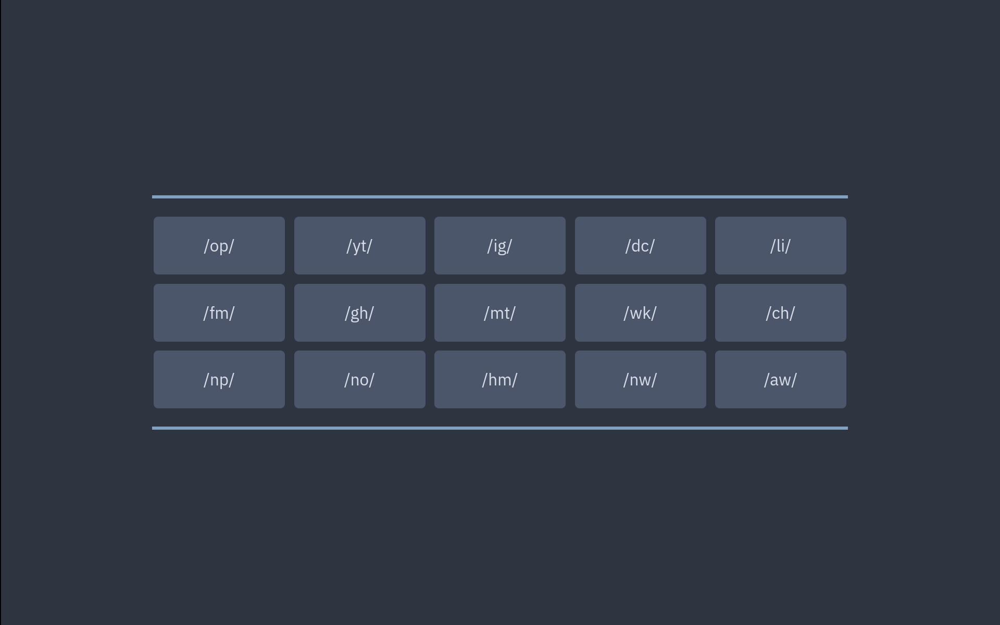

# homepage

A pure Nix static homepage generator. Clean, keyboard-navigable startpages with
zero dependencies and full control over layout, colors, etc.



## Contents

<!--toc:start-->

- [Features](#features)
- [Example](#example)
- [How It Works](#how-it-works)
  - [Example](#example)
- [Customizing Colors](#customizing-colors)
- [Layout Reference](#layout-reference)
- [Outputs](#outputs)
- [Keyboard Shortcuts](#keyboard-shortcuts)

<!--toc:end-->

## Features

- **Declarative layout**: define your homepage structure entirely in Nix.
- **Easy theming**: easily customize colors, fonts, etc. uses with the Nord
  theme by default.
- **Keyboard shortcuts**: type the short name to instantly open a link.
- **Dynamic hover colors**: links smoothly change to aurora tones on hover.
- **Pure Nix**: uses only `builtins`, so it works anywhere without external
  dependencies.

## Example

You can build and preview the included example homepage directly:

```bash
nix build github:sotormd/homepage
```

This creates a symlink `result` in the current working directory, which can be
opened in the browser.

## How It Works

The flake exposes a single function:

```nix
lib.makeHomepage
```

It takes a **layout list**, where each element is either:

- a **list of links**, or
- the string `"separator"` (to visually separate sections).

### Example

```nix
home.lib.makeHomepage {
  layout = [
    [
      { short = "re"; full = "reddit"; url = "https://reddit.com"; }
      { short = "dc"; full = "discord"; url = "https://discord.com/app"; }
    ]

    "separator"

    [
      { short = "yt"; full = "youtube"; url = "https://youtube.com"; }
      { short = "gh"; full = "github"; url = "https://github.com"; }
    ]
  ];

  n = 2;                    # grid size (columns per row)
}
```

## Customizing Colors and Fonts

The `lib.makeHomepage` function takes the `colors` and `fonts` arguments, which
can be used to customize the colors.

`colors` is an attribute set with the following:

| `colors.*` | explanation                       | type   | default                                            |
| ---------- | --------------------------------- | ------ | -------------------------------------------------- |
| `bg`       | background color for the page     | string | `"2e3440"`                                         |
| `btnbg`    | background color for buttons      | string | `"4c566a"`                                         |
| `fg`       | text color                        | string | `"d8dee9"`                                         |
| `accent`   | color for separators              | string | `"81a1c1"`                                         |
| `hover`    | button background colors on hover | list   | `[ "bf616a" "d08770" "ebcb8b" "a3be8c" "b48ead" ]` |

`font` is a string, the default is `JetBrains Mono`

Example usage:

```nix
home.lib.makeHomepage {
  layout = [
    [
      { short = "re"; full = "reddit"; url = "https://reddit.com"; }
      { short = "dc"; full = "discord"; url = "https://discord.com/app"; }
    ]

    "separator"

    [
      { short = "yt"; full = "youtube"; url = "https://youtube.com"; }
      { short = "gh"; full = "github"; url = "https://github.com"; }
    ]
  ];

  n = 2;                    # grid size (columns per row)

  colors = {
    bg = "ffffff";
    btnbg = "555555";
    fg = "000000";
    accent = "000000";
    hover = [ "000000" ];
  };

  font = "Fira Code";
}
```

## Layout Reference

Each layout element can be one of:

| Type              | Description                  | Example                                                                    |
| ----------------- | ---------------------------- | -------------------------------------------------------------------------- |
| **List of links** | A row of link boxes          | `[ { short = "yt"; full = "youtube"; url = "https://youtube.com"; } ... ]` |
| **"separator"**   | Horizontal line between rows | `"separator"`                                                              |

Each link entry looks like:

```nix
{ short = "yt"; full = "youtube"; url = "https://youtube.com"; }
```

## Outputs

| Output                      | Description                         |
| --------------------------- | ----------------------------------- |
| `lib.makeHomepage`          | Function that generates static HTML |
| `packages.<system>.default` | Example homepage (`nix build .`)    |

## Keyboard Shortcuts

Each link can be opened by typing its **short name** directly in the browser.

For example, in the provided example package:

```
yt → opens YouTube 
gh → opens GitHub
```
